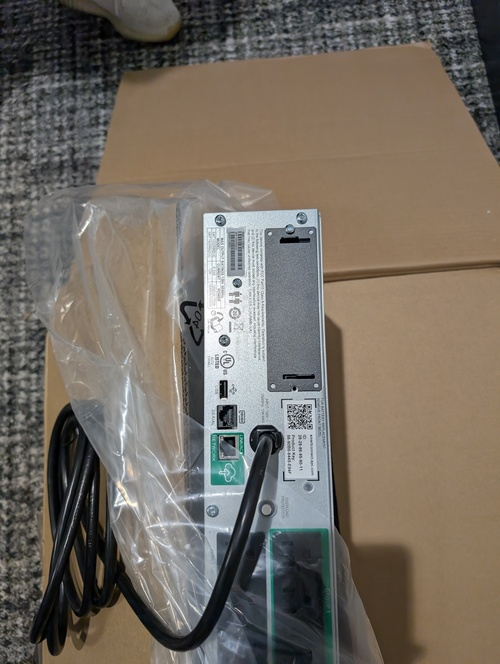
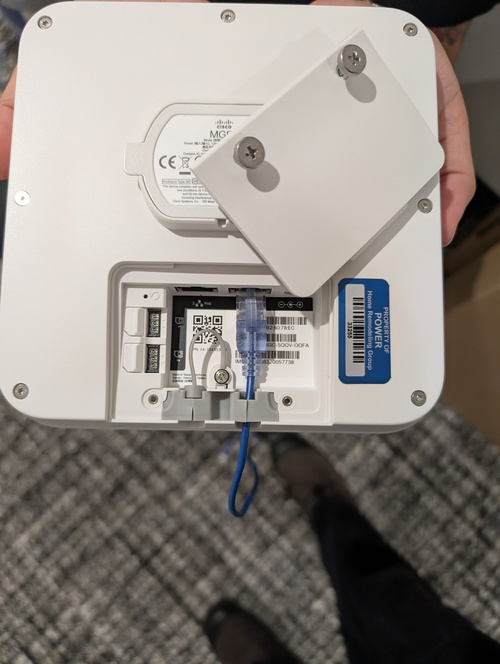

## Before Departing

#### Recommended Tools
- Precision screw drivers
	- PH1, PH2
	- Hex 2mm (not sure of size for drop ceiling mounting hardware, but the included one is a pain to use)
- Electric screwdriver (would make racking and mounting easier)
	- PH1, PH2 bits

#### Extra Equipment
- Ensure you bring enough:
	- Ethernet Patch Cables of appropriate sizes (1ft, 2ft, etc)
	- Extra Power Cables of appropriate length
		- Most of the equipment that requires an AC connection provides a cable, but depending on how the UPS is mounted, you may need longer power cables than what are provided by the manufacturer
	- Extra Rack bolts

## Upon Arrival

#### Inspect the LAN Room or install location
- Ensure ethernet drops are terminated in patch panels as appropriate
- Double check that rack nuts are installed where needed, or install them
- 
- Note which jacks in the panel are populated from the rear of the rack, if not all of them
- Identify wall outlet that rack UPS will plug into

#### Begin Racking equipment
- General practice is to start with the MX unit at the top of the rack, and then proceed with the Switches adjacent to the patch panels

	> **Note!** Switches in particular may need support to aid in installation, either getting help from a second individual or using a temporary racking shelf is recommended.

- 

- 
	- With two screws in opposite corners all the meraki equipment will be able to support itself while the remaining screws are secured
- Racking the UPS
	- Before racking: 
		- Install the network card
			- This will be packed separately and installs into the rear of the unit
			- 
			- 
			- 
	> **Note!** The UPS units are quite heavy and the weight is not distributed evenly, it is highly recommended to have two people to move these into place. 
	It is recommended to mount the UPS low down in the rack, for stability and to avoid strain during installation.

	> ***Below Instructions may vary depending on specific UPS unit***

	- Begin by mounting the included support rails in the desired location
		- Position the support rails such that the shelf portion is toward the side of the rack where front of the unit will face (the side with the display and battery disconnect)
			- There are cases where the UPS will make sense to mount in reverse to the other equipment, plan your spacing and power cable routes before beginning mounting
		- The support rails are threaded so do not require rack nuts, and install behind the rack rails instead of in front
		- They also require the specific included screws and washers to mount securely in place
			- Make sure all required screws are threaded in place before tightening
			- 
			- Ensure the rails are aligned such that the screws are able to tighten so the heads are nearly flush with the rack rails
			- 
	- Slide the UPS onto the rails
		- 
	- Once the UPS is secure, remove the warning tape and connect the battery ensuring it is fully seated
	- 
	- 
	- Plug the UPS into the wall outlet identified earlier
		- If working in an enclosed rack, be sure to route the power cable through a cable door or grommet

## Initial Setup

#### UPS Setup
- Power on the UPS (large horizontal button above the display)
- Proceed through the setup wizard
- 
- Once the UPS is ready, proceed to plug in power cables for the other rack equipment

#### MX Setup
- Once the MX unit has power, connect the ISP equipment to the primary WAN port of the MX
		- Using the SFP is generally preferred here, but ethernet works if SFP is unavailable for any reason
	- 
	- With the uplink to the ISP connected, the indicator light on the front of the unit should change from orange to cycling through rainbow colors.
	- Upon successful connection the indicator light will begin to flash white, indicating that it is downloading its configuration
	- If the indicator light reverts to orange, this may indicate that further [manual configuration](MX Manual Configuration) is needed, but continue to MG Setup before resorting to manual configuration.

#### MG Setup
- Ensure you are able to identify the jack in the patch panel that corresponds to the termination at the mounting point for the MG
- Connect that jack to the PoE enabled WAN port on the MX unit (marked with a lightning bolt symbol) with an ethernet patch cable
- 
- With the MX powered on locate the mounting point for the MG Unit as provided on the network map.
- Connect the ethernet and mount the MG according to the [mounting instructions](MG Mounting and installation)
- With ethernet connected the MG should begin cycling through rainbow colors on its indicator light as it attempts to connect
	- Depending on configuration it may be able to connect on its own, or it may need configuration via Meraki Cloud
> If the indicator light does not illuminate, ensure the correct jack on the patch panel and the MX unit are connected. The corresponding indicator light for the WAN port on the MX will illuminate green when it has made a connection

#### Connecting the Switches
- Switches should be connected using an Ethernet SFP to the Ethernet LAN ports on the MX Unit.
- 
- 
- Once connected and powered on, the switches' indicator lights should cycle through rainbow colors. If the MX has a successful uplink, the switches will then proceed to blink white to indicate they are downloading a configuration, and display a steady white indicator when functioning normally.
- No manual configuration should be required outside of Meraki Cloud
> If the indicator light on the switches displays orange, this likely means additional configuration of the MX is required

#### Mounting APs
- Consult included instructions
- Be sure to plug in the ethernet cable before final mounting
- Make sure the ceiling tiles are fully seated after installation is complete

#### Patching the rest of the panel
- Using the shortest cables appropriate, but without strain on the cables, connect each jack in the patch panel to a corresponding port on the switches
- Which port goes to which jack is generally not significant except that you should avoid cables crossing as much as possible in order to maintain a neat appearance and ease of maintenance if required
- 

Once the rack is fully patched the access points should come up, and if the MX and MG are configured, everything should be connected.

Ensure the MX and all the switches' indicator LEDs are displaying solid white.

At this point the hardware setup should be complete, and any further configuration can be handled via the cloud.

Ensure to clean up the trash from all of the equipment and packaging, and leave the LAN room and the rest of the facility as clean as you found it.